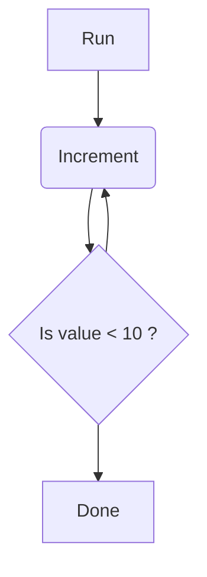

# Flux

## Usage

Define your store, like `MyStore`.

Create a flux environment including the initial value for your store.

```python
from actyon.flux import Flux

flux: Flux[MyStore] = Flux[MyStore](initial=initial_store)
```

Create reducers like this:

```python
@flux.reducer
async def my_reducer(state: MyStore, action: Flux.Action) -> MyState:
    # your magic code ...
    return state
```

Optionally, add effects that are executed after successful reducers:

```python
@flux.effect("my_reducer")
async def my_effect(state: MyStore) -> None:
    # do whatever you want with the state, just don't expect alterations will affect other functions
```

Finally, run your flux!

```python
await flux.run()
await flux.dispatch("my_reducer")
await flux.done()
```

## Example: Counter

Please find the code [here](https://github.com/neatc0der/actyon/tree/master/examples/counter.py).



## Experimental

Registering a hook introduces a neat debug output on transitions:

```python
from actyon.flux import FluxHook

flux: Flux[MyStore] = Flux[MyStore](initial=initial_store, hook=FluxHook())
```

Result:

```shell
$ python my_flux.py
Actyon: my_reducer ✓
```
