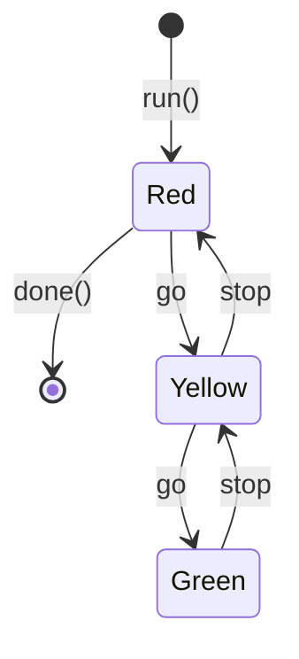

# State Machine

## Usage

Define your `State`s and `Transition`s in your very own `StateMachine`:

```python
from actyon.sm import State, StateMachine, StateStore

class MyMachine(StateMachine):
    state_1: State = State("state_1")
    state_2: State = State("state_2")

    state_1.to(state_2, "my_trigger")
```

Afterwards you may want to add logic to your state changes. Feel free:

```python
my_machine: MyMachine = MyMachine()

@my_machine.after("my_trigger")
async def after_my_trigger(state: StateStore, data: Dict[str, Any]) -> None:
    print(state.previous, "->", state.current)
    print("bomb went off:", data.get("tick_tick", "puff"))
```

Finally, run your machine:

```python
    await my_machine.run()
    await my_machine.trigger("my_trigger", tick_tick="boom")
    await my_machine.done()
```

## Example: Traffic Light

Please find the code [here](https://github.com/neatc0der/actyon/tree/master/examples/traffic_light.py).



Output:

```shell
RYG
●○○ runtime: 0.0000 seconds
○●○ runtime: 0.0006 seconds
○○● runtime: 1.0030 seconds
○●○ runtime: 5.0050 seconds
●○○ runtime: 1.0036 seconds
```

## Experimental

Registering a hook introduces a neat debug output on transitions:

```python
from actyon.sm import StateHook

my_machine: MyMachine = MyMachine(hook=StateHook())
```

Result:

```shell
$ python my_machine.py
Actyon: my_trigger ✓ ⇨ state: state_2
```
